# AI Traffic Management Sandbox

A browser-based, multiplayer-capable 2D traffic sandbox where a hybrid classical/RL AI controls signals across a road network populated by AI-driven vehicles **and** pedestrians. Connected users can drop into a car — with full Matter.js physics, real collisions, and touch or keyboard control — and become a disruptive input the AI has to handle live.

---

## Architecture Overview

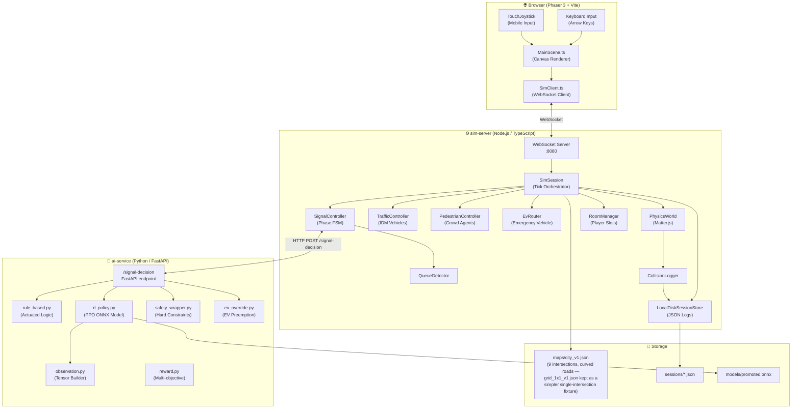

---

## Monorepo Package Structure

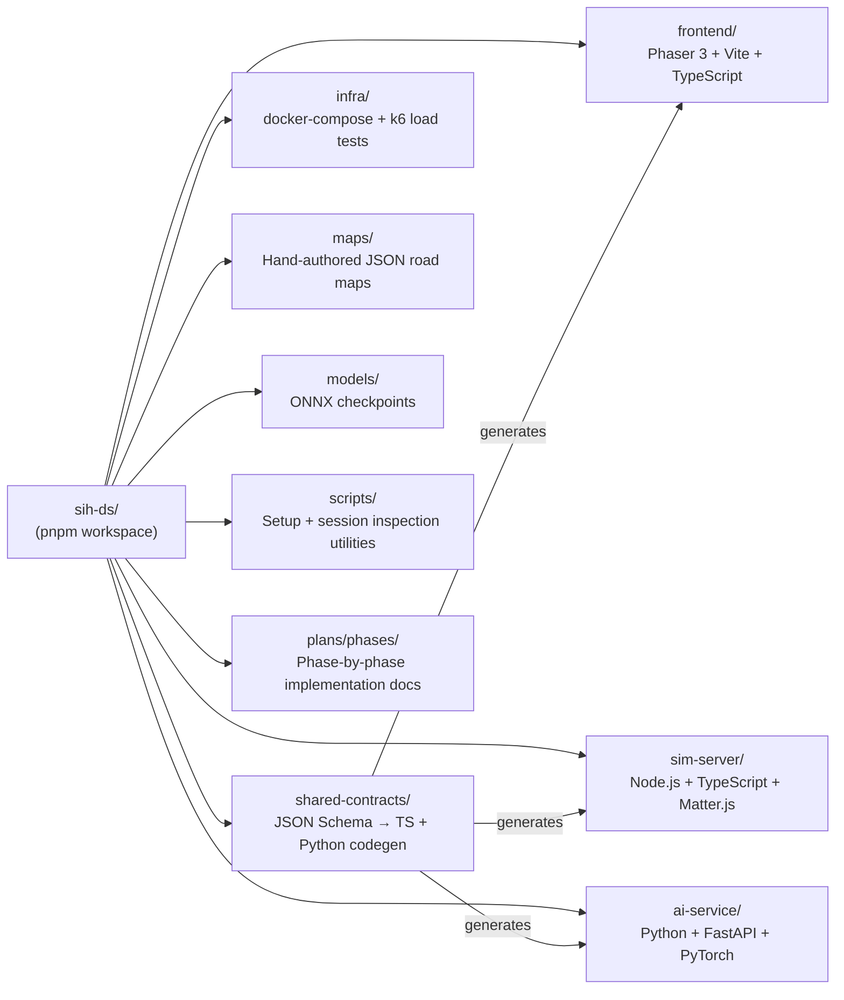

---

## Component Dependency Graph (sim-server)

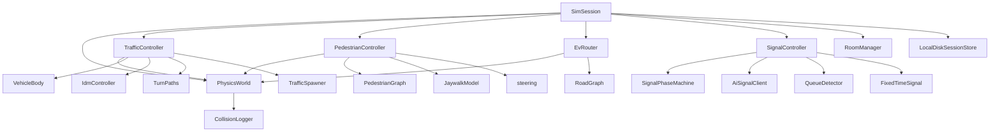

---

## Sequence Diagram — Per-Tick Game Loop (20 Hz / 50 ms)

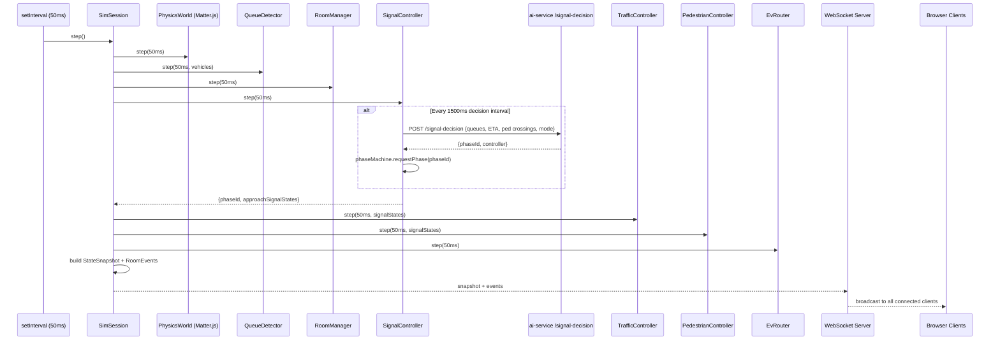

---

## Sequence Diagram — User Joining & Driving

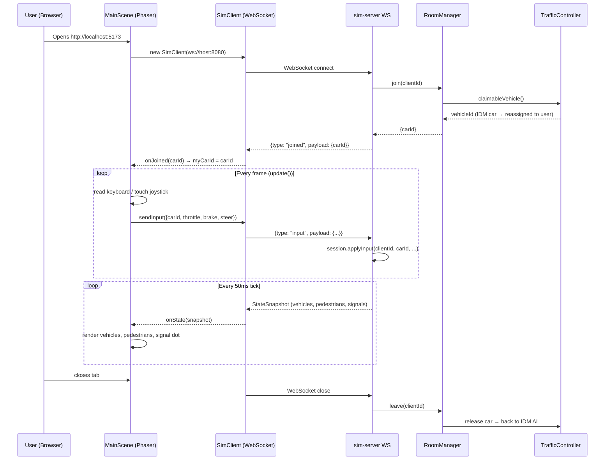

---

## Sequence Diagram — Emergency Vehicle Preemption

```mermaid
sequenceDiagram
    participant U as User
    participant FE as Frontend (key E)
    participant WS as sim-server WS
    participant SS as SimSession
    participant TC as TrafficController
    participant EVR as EvRouter
    participant SC as SignalController
    participant AI as ai-service /signal-decision
    participant LOG as SessionStore (JSON)

    U->>FE: Press E
    FE->>WS: {type: "debug_spawn_ev", payload: {origin: "far_i3", dest: "far_i7a"}}
    WS->>SS: spawnEmergencyVehicle("far_i3", "far_i7a")
    SS->>TC: vehicles (current traffic positions)
    SS->>EVR: spawn("far_i3", "far_i7a", traffic.vehicles)
    Note over EVR: Refuses to spawn if an existing vehicle already occupies the route's start point (spawn-clearance check) - returns error "spawn_blocked" instead of materializing on top of it and crashing on tick zero.
    EVR-->>SS: {evId}
    SS->>LOG: write ev_spawn event
    SS-->>WS: room_event {kind: "ev_spawn", evId, route} (broadcast live, not just logged)

    loop Every 50ms tick
        SS->>EVR: step(50ms)
        SS->>SC: getEvContext() → {evId, etaS, requiredPhaseId}
        SC->>AI: POST /signal-decision {evContext: {evId, etaS, requiredPhaseId}}
        AI->>AI: apply_ev_override(proposed_phase, ev_context)
        AI-->>SC: {phaseId, controller: "ev_preempt"}
        SC->>SC: force that phase at every upcoming intersection within its preemption threshold of its own ETA
    end

    SS->>LOG: write ev_preempt event {intersection, etaS}
    SS-->>WS: room_event {kind: "ev_preempt", intersectionId, etaS}

    Note over EVR: EV reaches its destination approach and despawns
    EVR-->>SS: activeVehicle() = null
    SS->>LOG: write ev_complete event {evId, transitTimeS}
    SS-->>WS: room_event {kind: "ev_complete", evId, transitTimeS}
    SC->>AI: POST /signal-decision {evContext: null}
    AI-->>SC: normal rule_based / RL decision
    Note over FE: Held traffic finally served; the live-analytics panel logs each of these events
```

---

## Signal Controller State Machine

Every intersection defines its own phases with an explicit `allowedApproachIds` list (see
[Map Data Model](#map-data-model) below) — `city_v1.json`'s intersections use generic `p1`/`p2`
phase IDs (2 phases each), while the older `grid_1x1_v1.json` fixture happens to name them
`NS_through`/`EW_through`. Nothing downstream cares which naming a map uses; `SignalPhaseMachine`
only ever deals in whatever phase-ID strings a given map defines. **Two approaches grouped into the
same phase are explicitly meant to move simultaneously** — `TrafficController`'s intersection-box
mutex only ever serializes vehicles from *different* phases, never same-phase traffic (an earlier
version serialized everyone, which throttled real intersection throughput badly — see the
[Traffic Engine Robustness](#traffic-engine-robustness) section).

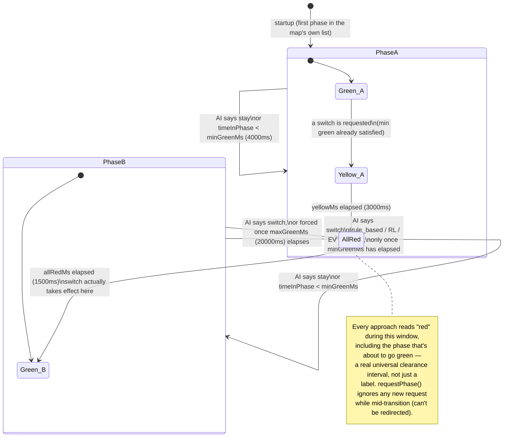

---

## AI Signal Decision Pipeline

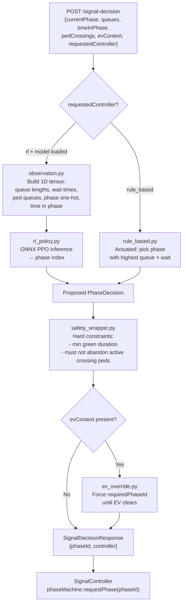

---

## Data Schema — State Snapshot (WebSocket broadcast)

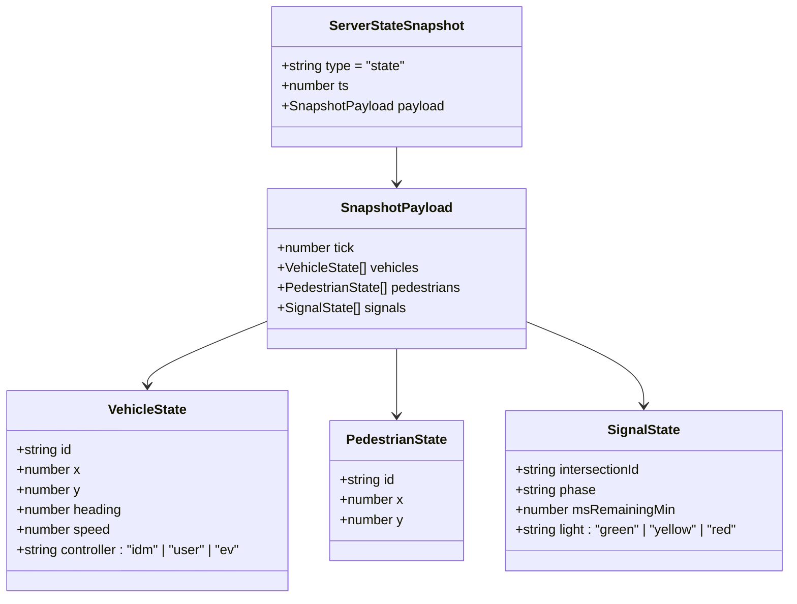

---

## Data Schema — Room Event Message (WebSocket broadcast)

Unlike the `state` message above (broadcast every tick), `room_event` messages are pushed only when
something notable happens — a user joins/leaves, a collision occurs, or an emergency vehicle is
spawned/preempts a signal/completes its route. The frontend's live analytics panel
([Frontend HUD & Controls](#frontend-hud--controls)) renders these as they arrive.

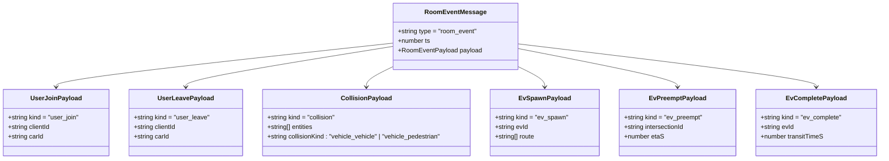

Defined in `shared-contracts/schemas/room-events.schema.json` and code-generated into both
`sim-server` (TypeScript) and `ai-service` (Python) via `pnpm --filter shared-contracts generate`.

---

## Data Schema — Session Event Log (JSON on disk)

```mermaid
classDiagram
    class SessionFile {
        +string sessionId
        +string startedAt
        +string mapId
        +string|null scenario
        +SessionParticipant[] participants
        +SessionEvent[] events
        +KpiSnapshot[] kpiSnapshots
        +FinalScore|null finalScore
    }
    class PhaseChangeEvent {
        +number t
        +string type = "phase_change"
        +string intersection
        +string phase
        +string controller : "rule_based" | "rl"
    }
    class UserJoinEvent {
        +number t
        +string type = "user_join"
        +string clientId
        +string carId
    }
    class UserLeaveEvent {
        +number t
        +string type = "user_leave"
        +string clientId
        +string carId
    }
    class CollisionEvent {
        +number t
        +string type = "collision"
        +string[] entities
        +string kind : "vehicle_vehicle" | "vehicle_pedestrian"
        +string cause? : "jaywalk"
    }
    class EvSpawnEvent {
        +number t
        +string type = "ev_spawn"
        +string evId
        +string[] route
    }
    class EvPreemptEvent {
        +number t
        +string type = "ev_preempt"
        +string intersection
        +number etaS
    }
    class EvCompleteEvent {
        +number t
        +string type = "ev_complete"
        +string evId
        +number transitTimeS
    }
    class KpiSnapshot {
        +number t
        +number avgVehicleWaitS
        +number throughput
        +number avgPedWaitS
        +number jaywalkEvents
    }
    class FinalScore {
        +string scenario
        +string result : "pass" | "fail"
        +number avgWaitDeltaPct
    }

    SessionFile --> PhaseChangeEvent
    SessionFile --> UserJoinEvent
    SessionFile --> UserLeaveEvent
    SessionFile --> CollisionEvent
    SessionFile --> EvSpawnEvent
    SessionFile --> EvPreemptEvent
    SessionFile --> EvCompleteEvent
    SessionFile --> KpiSnapshot
    SessionFile --> FinalScore
```

`ev_spawn`/`ev_preempt`/`ev_complete` are also broadcast live over the WebSocket as `room_event`
messages the instant they happen (not just written to this on-disk log) — see the
[room_event schema](#data-schema--room-event-message-websocket-broadcast) below and the live
analytics panel in [Frontend HUD & Controls](#frontend-hud--controls).

---

## Map Data Model

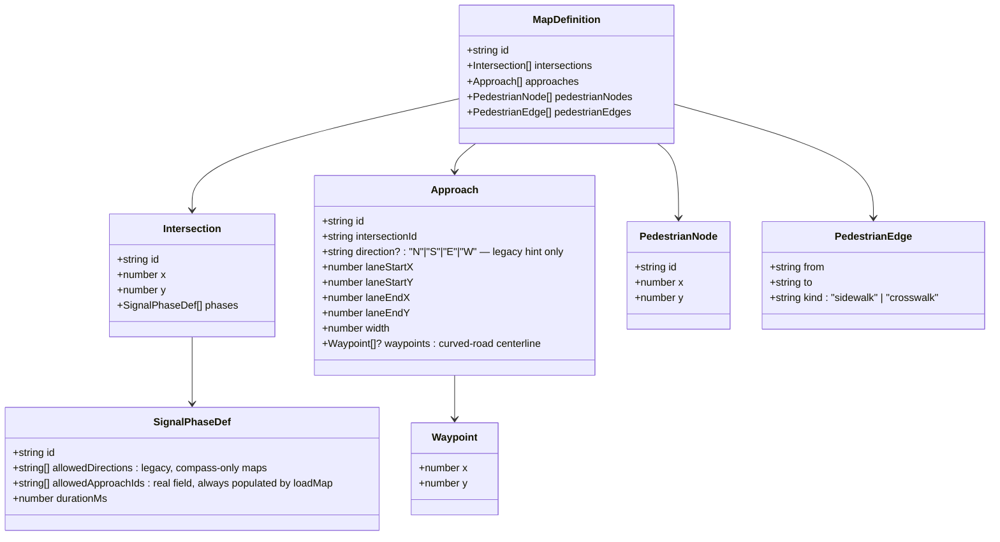

`direction` and `allowedDirections` are legacy compass-based fields, still used by
`grid_1x1_v1.json` (the simple single-intersection fixture); `loadMap` normalizes them into
`allowedApproachIds` on load, and every piece of geometry/routing/signal logic downstream reads
`allowedApproachIds` and computed headings, never the compass fields directly. `city_v1.json`
(9 intersections, curved connectors) sets `allowedApproachIds`/`waypoints` explicitly and omits
`direction`/`allowedDirections` entirely — both map styles are fully supported by the same schema.

---

## Pedestrian Agent Behaviour

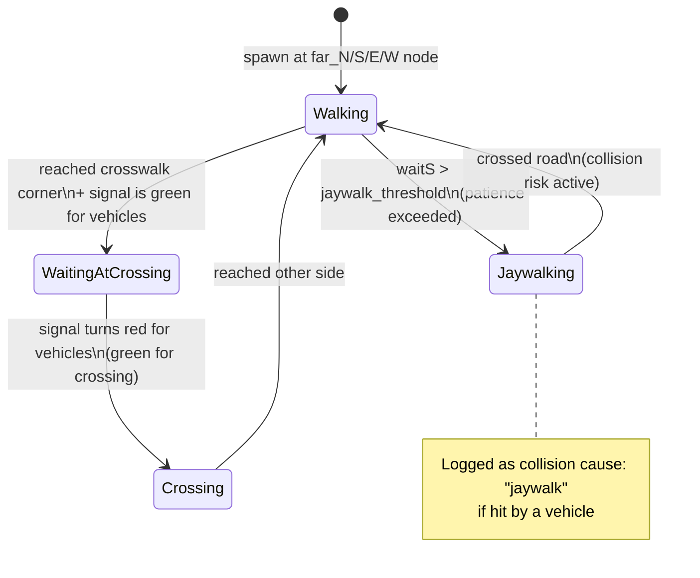

---

## CI/CD Pipeline

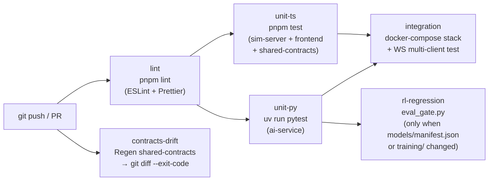

There is no automated `deploy` job — Fly.io deploys are a deliberate manual step (see below), not
part of this pipeline.

---

## Deployment Topology

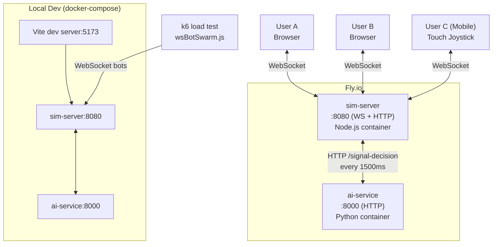

### Fly.io deployment (one-time manual setup)

> **Not needed for local development.** Everything in this section is only for deploying a public,
> always-on instance — running the app locally (Docker Compose or the local-dev-processes mode,
> both via `scripts/setup.sh`/`setup.ps1`) never touches Fly.io and never asks for any payment
> details. `scripts/setup.sh`/`setup.ps1` do include an optional, skippable "set up Fly.io
> deployment?" prompt for when you're ready for this step — just answer no (the default) until then.
>
> **Heads-up before you start:** Fly.io now requires a payment method on file to verify you're not
> a bot, even to use its free monthly allowance — you'll hit a "we think you're a human, but our
> system does not" card-verification wall on signup. If you'd rather not add a card at all, a
> genuinely no-card alternative is [Render.com](https://render.com) (free tier, supports
> WebSockets and Docker deploys — trade-offs: free services sleep after 15 min idle, and free-tier
> disks aren't persistent, so session JSON would reset on restart/redeploy instead of surviving
> it like Fly's volume does). Swapping `infra/fly/` for a Render blueprint is a contained, doable
> change whenever this is actually needed — ask for it and it can be done as its own step, deferred
> for now since deployment isn't blocking local development.

`sim-server` serves the built frontend directly (see its `Dockerfile`), so only two Fly.io apps are deployed — there is no separate frontend hosting app.

```bash
flyctl auth login
flyctl apps create traffic-sim-server
flyctl apps create traffic-ai-service
flyctl volumes create sessions_data --app traffic-sim-server --size 1 --region iad
```

Deploys are a deliberate manual step, not part of CI — run these whenever you're ready to ship a new version:
```bash
flyctl deploy --config infra/fly/ai-service.fly.toml
flyctl deploy --config infra/fly/sim-server.fly.toml
```

---

## Local Dev Setup

### Option A: interactive setup script (recommended)

A single script checks every prerequisite (Node 20+, pnpm, Python 3.12+, uv, optionally Docker),
offers to install anything missing, installs/generates project dependencies, then lets you choose
how to run the stack (Docker Compose, local dev processes, or just set up without running).

```bash
./scripts/setup.sh          # macOS / Linux
```
```powershell
.\scripts\setup.ps1         # Windows (PowerShell)
```

Re-run the same script anytime — it's safe to run repeatedly and will just skip anything already
satisfied.

The script also offers an optional, separate step for setting up Fly.io deployment (installs
`flyctl`, logs in, creates the two apps + volume if missing) — this is entirely skippable and has
nothing to do with running the app locally. See [Fly.io deployment](#flyio-deployment-one-time-manual-setup)
below before opting into it, since Fly.io requires a payment method on file even for its free tier.

### Option B: manual steps

```bash
pip install uv              # required for shared-contracts Python codegen
pnpm install
pnpm --filter shared-contracts generate
docker compose -f infra/docker-compose.yml up --build
```

Or, for faster iteration without Docker, run the three services directly (each in its own terminal):

```bash
cd ai-service && uv sync && uv run uvicorn app.main:app --port 8000
AI_SERVICE_URL=http://localhost:8000 pnpm --filter sim-server dev
pnpm --filter frontend exec vite
```

Either way, then open **http://localhost:5173**.

### Regenerating art assets (optional)

The frontend ships with a pre-generated sprite atlas (`frontend/assets/atlas/`) committed to the
repo, so a fresh clone works out of the box with no extra step. Only regenerate it if you change
the source art or the procedural generation script:

```bash
pnpm --filter frontend assets:generate   # redraws frontend/assets/source/*.png
pnpm --filter frontend assets:pack       # repacks them into the atlas MainScene loads
```

---

## Frontend HUD & Controls

### Camera

| Control | Action |
|---|---|
| Click + drag (mouse or touch) | Pan the camera |
| Scroll wheel | Zoom in/out (fits the full 9-intersection city map at min zoom, up to a close per-vehicle view at max zoom) |
| Hover over a signal dot | Shows a tooltip: intersection id, current light color, active phase id, and time remaining in the phase |

### Driving

| Control | Action |
|---|---|
| `↑ / ↓` | Throttle / Brake |
| `← / →` | Steer |
| `E` | Spawn an emergency ambulance on the demo multi-hop route (`far_i3` → `far_i7a`) |
| Touch joystick | Mobile throttle/steer overlay (bottom-left) |
| `[toggle AI mode]` button | Switch signal controller: `rule_based` ↔ `rl` |

### Legend (key table)

A `Phaser.GameObjects.Container` in the top-left renders a color-swatch key table (car controller
colors — AI/player/emergency — road/sidewalk/crosswalk tiles, and signal-light colors) so the map
is readable without prior context. It repositions as a single unit on window resize.

### Live analytics panel

A black, semi-transparent panel on the right edge of the screen streams real-time text logs, fed
directly by genuine backend data (not simulated for display):
- Every `room_event` broadcast over the WebSocket — `ev_spawn`, `ev_preempt`, `ev_complete`,
  `collision`, `user_join`, `user_leave` — see the [room_event schema](#data-schema--room-event-message-websocket-broadcast).
- KPI snapshots (`avgVehicleWaitS`, `throughput`, `avgPedWaitS`, `jaywalkEvents`) as they arrive.
- Signal phase changes, detected client-side by diffing each intersection's current phase against
  its previously-seen phase.

The panel caps at 16 visible lines (oldest entries scroll off) so it never grows unbounded during
a long session.

---

## Traffic Engine Robustness

The engine includes several deliberate mechanisms to keep vehicles moving under real physics
without gridlocking, on top of ordinary IDM car-following and signal control:

- **Lane-offset road geometry** — every approach's centerline (straight or curved/waypointed) is
  offset perpendicular to travel heading by `LANE_OFFSET = 6` units (`TurnPaths.ts`), so opposing
  traffic on the same road doesn't share a single centerline path.
- **Same-signal-phase occupancy exemption** — the intersection box has a mutex so only one
  *conflicting* approach's traffic occupies it at a time, but two approaches whose vehicles are
  meant to move simultaneously (i.e. they belong to the same active signal phase) are explicitly
  exempted from blocking each other (`TrafficController.isSameSignalPhase`).
- **Stall-escape valve (fast path)** — a narrowly-gated safety mechanism that detects a vehicle in
  genuine, sustained Matter.js physical contact with another vehicle (not merely "slow," and never
  while actually obeying a red/yellow light) and nudges it forward a small, clamped distance along
  its own path. This exists because IDM's gap-based braking has no way to recover once a leader is
  truly touching — the physics engine itself doesn't provide compliant "give" the way real traffic
  does. Fires within 1.5s of genuine contact.
- **No-progress escape valve (slow path)** — a second, independent safety net for a vehicle that's
  genuinely stuck for a completely different reason with no physical contact involved at all: the
  intersection-occupancy mutex above can manufacture an effective "red" for a vehicle whose own
  signal is actually green, because it's waiting on another vehicle currently sitting in the box —
  and if that occupant is itself stuck the same way, recursively, no vehicle in the chain ever
  registers as "physically stalled," so the fast path above never fires for any of them. Once a
  vehicle's real path position hasn't advanced in over 35 seconds — well above the ~24.5s worst-case
  legitimate wait at a real red light, but far below "forever" — it's rescued the same way.
- **Both valves share the same two hard safety gates**: neither ever fires while a vehicle is
  genuinely obeying its own red/yellow light or blocked by an actual pedestrian in its path (only an
  artificially mutex-manufactured block is eligible), and the nudge distance is always clamped to
  the vehicle's own next stop line, so a rescue can never push a vehicle past a light it hasn't
  earned the right to cross.
- **Occupancy/stall interaction fix** — the occupancy mutex disregards an occupant flagged as
  stalled by either valve, so a stuck vehicle can't manufacture a permanent "red" for other
  approaches waiting on the same intersection.
- **Vehicle density cap** — `MAX_VEHICLES_PER_APPROACH = 3` (tuned down from `8` to `5` to `3` across
  this session, each step verified against the real `ai-service` under sustained load — lower
  consistently produced higher completion counts and less time spent near-zero speed at this road
  width). The default free-play arrival rate (`ARRIVAL_RATE_PER_MIN`) and the scenario configs in
  `scoring/scenarios.ts` were retuned alongside it, since they were originally tuned against the
  higher cap.

---

## Manual Smoke Tests

### Phase 1 — Core physics & signals
1. Open the browser tab — the 9-intersection `city_v1` map should render with roads, curved
   connectors, and a distinct signal dot at every intersection.
2. Hold **↑** — the car should accelerate forward under physics (not teleport).
3. Hold **↓** — the car should decelerate.
4. Hold **← / →** — the car should rotate.
5. Hover over any signal dot — a tooltip should show its id, light color, phase, and time
   remaining; each intersection's light should switch on its own independent cycle.
6. Drive into a lane boundary — the car should deflect, not clip through it.
7. Click-drag to pan and scroll to zoom — the camera should move smoothly across the full map.

### Phase 5 — Pedestrian agents
1. Small yellow circles should appear walking along the sidewalks and crosswalks.
2. While a vehicle signal is green, pedestrians at corners should wait.
3. When the vehicle signal turns red, waiting pedestrians should cross.
4. After sufficient waiting, a pedestrian should **jaywalk** across outside the crosswalk lines.
5. Drive through a jaywalking pedestrian — confirm a real collision deflection, and check the session JSON for `collision` with `kind: "vehicle_pedestrian"` and `cause: "jaywalk"`.

### Phase 7 — Emergency vehicle preemption
1. Press **E** to spawn an ambulance on the `far_i3` → `far_i7a` demo route.
2. If another vehicle is currently blocking the spawn point, the spawn is refused
   (`{error: "spawn_blocked"}`) rather than materializing on top of it — try again once the origin
   is clear.
3. Confirm a red vehicle appears driving faster than regular traffic, and that the live analytics
   panel logs an `ev_spawn` line.
4. As it approaches each intersection along the route, that intersection's phase should lock green
   even if conflicting traffic is queued, and the panel should log an `ev_preempt` line with its ETA.
5. Once the ambulance reaches its destination, confirm the panel logs `ev_complete` with its transit
   time, and check the session JSON for matching `ev_spawn`/`ev_preempt`/`ev_complete` events.

---

## Load Testing

```bash
docker compose -f infra/docker-compose.yml up -d
k6 run infra/load/wsBotSwarm.js
```

---

## Final Full-System Manual Verification (Phase 10)

Run this against the deployed Fly.io URL, not just localhost, at least once:

1. Load the deployed frontend URL; confirm it connects and a car can be claimed and driven (keyboard and touch).
2. Start each of the four scenarios in turn (Rush Hour, Emergency Vehicle, Chaos, Pedestrian Pressure); confirm each ends with a visible pass/fail result matching the KPI values shown in the HUD during the run.
3. Confirm the KPI panel updates live: avg wait, throughput, pedestrian wait, jaywalk count, current AI mode.
4. Toggle classical/RL mode mid-session; confirm signal behavior visibly changes.
5. Trigger the emergency-vehicle scenario; confirm preemption and release both happen, and the session JSON (if `DEBUG_ENDPOINTS` is enabled in a throwaway local run — never against production) shows `ev_spawn`, `ev_preempt`, and `ev_complete`.
6. Restart the `traffic-sim-server` Fly.io app (`flyctl apps restart traffic-sim-server`) and confirm previously-written session files under the persistent volume survive the restart.
7. Confirm the repo is private and access has been shared only with the intended reviewers.

This checklist requires a live Fly.io deployment and cannot be completed by an automated agent — it is the final manual gate before considering Phase 10 (and the full build) done.
